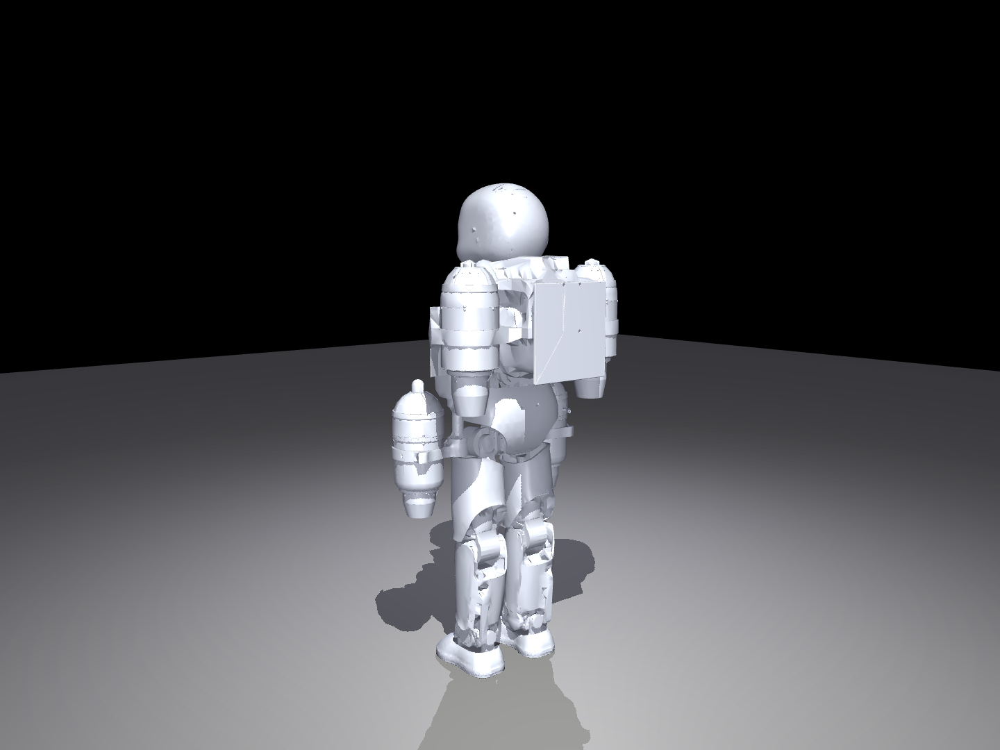

# ampmove

Bipedal locomotion for **iRonCub-Mk1_1** (jet-powered flying humanoid, [gbionics](https://github.com/gbionics)) via two parallel RL tracks, benchmarked against each other:

- **Track 1 — PPO baseline**: learn to walk from scratch, no demonstration data (SB3, MuJoCo)
- **Track 2 — AMP**: retarget real human mocap into a motion prior, then train with adversarial motion priors so style is shaped by the reference gait (SKRL, Isaac Lab)

The retargeting pipeline follows [ADHERENT](reference-paper.pdf) (arXiv:2309.12784) — direct joint-space mapping from BVH to the robot's URDF, no inverse kinematics.

<p align="center">
  
  <br>
  <sub>iRonCub-Mk1_1 loaded from URDF in MuJoCo — jet-turbine legs/backpack, 26 DOF, PD-held stance.</sub>
</p>

---

## Status

| Stage | Status |
|---|---|
| CMU BVH → iRonCub joint angles (retargeting) | ✅ done |
| MuJoCo visualization of retargeted motion | ✅ done |
| `.npy` → Isaac Lab `.npz` (FK + 6D rot + contacts) | ✅ done |
| PPO gym env (MuJoCo) | ✅ done |
| **PPO baseline training** | ✅ done — 2M steps, checkpoints + tensorboard logs in-repo |
| Isaac Lab motion replay (asset sanity check) | ✅ done |
| Isaac Lab AMP env + SKRL trainer | ✅ written, moving to Isaac Lab on a 4090 to train |
| **AMP training run** | 🔄 in progress |
| PPO vs. AMP comparison (does the motion prior help?) | ⏳ pending — write-up once the AMP run converges |

---

## Experiments

**Track 1 (PPO, no prior)** is trained and checked in — `checkpoints/ppo_ironcub/` (40 checkpoints to 2M steps) and `logs/ppo_ironcub/` (best/final model + 4 tensorboard runs). This is the from-scratch baseline every AMP result gets compared against.

**Track 2 (AMP, with motion prior)** is standing up on a 4090 now — env, discriminator, and SKRL trainer are written (`isaac_lab_track/`), asset conversion + a hardcoded-stance sanity check come first, then the actual AMP run.

The point of running both: **does conditioning on a real human motion prior get iRonCub to a better/faster/more natural gait than PPO gets to on its own?** That comparison is the open question this repo is currently answering — no conclusion yet, updates as the AMP run progresses.

---

## Repo structure

```
ampmove/
├── assets/iRonCub/
│   ├── meshes/stl/                        # STL meshes (tracked in repo)
│   ├── meshes/obj/                        # OBJ meshes (tracked in repo)
│   └── robots/iRonCub-Mk1_1/
│       ├── model.urdf                     # iDynTree FK (retargeting)
│       ├── model_stl.urdf                 # MuJoCo + Isaac Lab USD conversion
│       └── ironcub.usd                    # generated per-machine (see Isaac Lab setup)
│
├── configs/
│   └── ironcub_bvh_mapping.yaml
│
├── motion_priors/walking/
│   ├── 07_12.bvh                          # source CMU mocap (walking, subject 07)
│   ├── 07_12_retargeted_adherent.npy      # retargeted motion (root pose + joint angles)
│   └── 07_12_isaaclab.npz                 # Isaac Lab AMP input (FK link states + contacts)
│
├── retargeting/
│   ├── retarget_bvh_npy.py                # BVH → .npy
│   └── npy_to_npz.py                      # .npy → .npz (FK states + contacts for AMP)
│
├── mujoco_track/
│   ├── env.py                             # Gymnasium env (26-DOF, position control)
│   ├── visualize_retargeted.py            # motion replay in MuJoCo viewer
│   ├── train_ppo.py                       # SB3 PPO training
│   └── infer_ppo.py                       # load checkpoint + visualize
│
└── isaac_lab_track/
    ├── ironcub_cfg.py                     # ArticulationCfg
    ├── visualize_retargeted.py            # motion replay in Isaac Lab viewer
    ├── hardcode_stand.py                  # PD stand test — sanity-check USD + gains
    ├── amp_env.py                         # DirectRLEnv: policy/AMP obs, reward, RSI reset
    └── train_amp_ppo.py                   # SKRL AMP+PPO trainer
```

---

## Setup

### 1. Clone
```bash
git clone <repo-url>
cd ampmove
```

Meshes are tracked — no separate download needed.

### 2. Conda environment
```bash
conda create -n retarget python=3.10
conda activate retarget
```

### 3. Install idyntree with IPOPT
```bash
conda install -c robotology idyntree
```
Must be the conda version — pip idyntree does not include IPOPT.

### 4. Remaining dependencies
```bash
pip install mujoco==3.3.0 bvh scipy numpy stable-baselines3 gymnasium
```

---

## Track 1 — PPO (MuJoCo)

```bash
# Train
python mujoco_track/train_ppo.py
python mujoco_track/train_ppo.py --timesteps 3000000 --n-envs 4

# Resume
python mujoco_track/train_ppo.py --resume logs/ppo_ironcub/best_model.zip

# Visualize policy
python mujoco_track/infer_ppo.py logs/ppo_ironcub/best_model.zip

# Visualize retargeted motion
python mujoco_track/visualize_retargeted.py
```

Checkpoints → `checkpoints/ppo_ironcub/`, best model → `logs/ppo_ironcub/best_model.zip`.

---

## Track 2 — AMP (Isaac Lab)

### Step 1 — Convert URDF to USD (once per machine)

Requires Isaac Lab installed. Run from repo root:

```bash
python {ISAACLAB}/scripts/tools/convert_urdf.py \
    assets/iRonCub/robots/iRonCub-Mk1_1/model_stl.urdf \
    assets/iRonCub/robots/iRonCub-Mk1_1/ironcub.usd \
    --merge-fixed-joints
```

`ironcub.usd` is generated locally and not tracked in git.

### Step 2 — Simulate (motion replay, no RL)

```bash
python isaac_lab_track/visualize_retargeted.py
python isaac_lab_track/visualize_retargeted.py --headless
```

Replays `07_12_retargeted_adherent.npy` at 120fps — good for verifying the asset and motion look correct before training.

### Step 3 — Stand test (sanity-check the asset + PD gains)

```bash
python isaac_lab_track/hardcode_stand.py
python isaac_lab_track/hardcode_stand.py --headless --duration 20.0
```

### Step 4 — AMP training

```bash
python isaac_lab_track/train_amp_ppo.py --headless --num_envs 4096
python isaac_lab_track/train_amp_ppo.py --checkpoint logs/amp_ironcub/agent_50000.pt
```

Logs → `logs/amp_ironcub/`.

---

## Regenerating motion priors (already done, for reference)

```bash
# BVH → retargeted .npy
python retargeting/retarget_bvh_npy.py \
    motion_priors/walking/07_12.bvh \
    motion_priors/walking/07_12_retargeted_adherent.npy \
    configs/ironcub_bvh_mapping.yaml

# .npy → Isaac Lab .npz
python retargeting/npy_to_npz.py \
    motion_priors/walking/07_12_retargeted_adherent.npy \
    motion_priors/walking/07_12_isaaclab.npz
```

---

## Retargeting — design notes

**No IK.** iRonCub has 26 DOFs. With only 2 foot position targets, IPOPT finds degenerate solutions. BVH Euler angles are mapped directly to robot joints using URDF axis analysis.

**Coordinate transform.**
CMU BVH is Y-up, walk direction +Z. iRonCub world is Z-up, forward +X.
```
BVH2W = [[0,0,1], [1,0,0], [0,1,0]]
```

**Sign conventions:**
| BVH channel | Robot joint | Sign | Reason |
|---|---|---|---|
| UpLeg Xrotation | hip_pitch | −1 | URDF axis [0,−1,0] |
| Leg Xrotation | knee | −1 | URDF axis [0,−1,0] |
| Foot Xrotation | ankle_pitch | +1 | URDF axis [0,+1,0] |

**MuJoCo loading.** Always use `model_stl.urdf` via `MjSpec.from_file()` with `meshdir` set. `model.xml` has an Rx(π) bug on leg bodies and is deleted.
